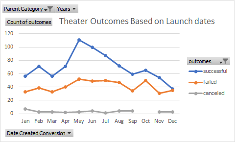
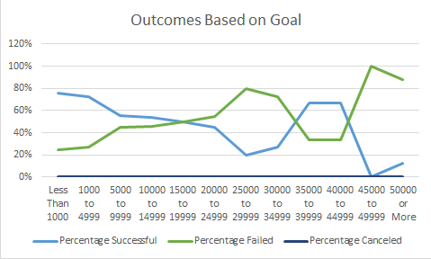

# Kickstarting with Excel

## Overview of Project

This project summarizes campaign performance based on launch dates and funding goals.  

### Purpose

## Analysis and Challenges

Outcomes Based on Launch Date: A pivot table was utiliized to filter data which was then plotted in a line chart. 
This line chart visualized the relationship between outcomes and launch months. 

In outcomes based on goals, COUNTIFS() function was utilized to filter data that was then used on the line chart. 

### Analysis of Outcomes Based on Launch Date

Outcomes based on Launch date were very successful in May but saw a sharp decline in June to around September.

There was an increase in failed outcomes from the month of May to July as well as October 

### Analysis of Outcomes Based on Goals

We had a high percentage of successful outcomes in the plays category when the goals set were lower. 

More than half of the successfful outcomes had less than $4,999 set as a goal.

### Challenges and Difficulties Encountered

Ensuring that the formulas used were working efficiently for all cells.

Formatting charts in diverse ways without overdoing it.

## Results

- What are two conclusions you can draw about the Outcomes based on Launch Date?

1.	May was a great month for the campaignas there was a spike of successful theater outcomes.
 
2.	June to September was not a great month for the campaign. 

- What can you conclude about the Outcomes based on Goals?
•	Lower goals should be set to decrease the number of failed outcomes. 

- What are some limitations of this dataset?

Using current data, we would not be able to tell the variance or interquatile range unless we added a grapg showing the results

- What are some other possible tables and/or graphs that we could create?
•	We could use a box and whisker to determine if there are any outliers and verify what the mean, median and mode would be.

